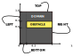

# GMsh/XDMF/DOLFIN mesh processing pipeline

This is a summary of the work done for the Google Summer of Code 2019. The primary goal of the project was to ensure that the meshing package of choice [gmsh](http://gmsh.info/), DOLFIN, and the preferred visualization package,[Paraview](http://paraview.org/) work seamlessly together. The intention was to make improvements to the process of preserving the information about tagged regions of the mesh when importing it to DOLFIN. There were two approaches that were finalized for the project.

- Preserve the string tags when converting from `.msh` to `.xdmf`.
- Add constructor to the class MeshValueCollection to support its creation from primitive arrays.

## Pull Requests List

### MESHIO

- [**PR #425**](https://github.com/nschloe/meshio/pull/425)-Add methods to read and write field\_data to XDMF - **merged on Aug 9**
  - This PR adds methods to preserve the mapping between the string tags and int tags when converting from `.msh` to `.xdmf`. The idea is to store this mapping inside the `<Information>` element of XDMF.

### DOLFINX

- [**PR #439**](https://github.com/FEniCS/dolfinx/pull/439) - Add function to read Information tag data in XDMF - **open**
  - This PR extends the functionality of XDMFFile interface with methods `read\_information()` and `write\_information()`. The methods are designed to read and write `<Information>` tag data of XDMF file format. The syntax is inline with XDMF standard and works well with PARAVIEW.
- [**PR #467**](https://github.com/FEniCS/dolfinx/pull/467) - Method to construct MeshValueCollection from arrays - **open**
  - This PR extends the functionality of MeshValueCollection class with constructor that supports its creation from primitive arrays.

## Demonstration

All the code snippets and changes made to the forks are present [here](https://github.com/iitrabhi/GSoC2019). Any user interested in testing out the code could go through the instructions presented in the readme file and follow along with the provided code snippets. In this demonstration, I will walk you through the implementation of the methods added to DOLFIN during this project period.



### Conversion of a mesh using meshio

The first task was to preserve the string tags when converting from `.msh` to `.xdmf`. For example, in a mesh file created with gmsh we have the following
```JAVA
$PhysicalNames
	6
	1 1 "LEFT"
	1 2 "TOP"
	1 3 "RIGHT"
	1 4 "BOTTOM"
	2 5 "DOMAIN"
	2 6 "OBSTACLE"
$EndPhysicalNames
```
This data was not preserved in the conversion from `.msh` to `.xdmf`. The goal was to preserve it within the XDMF file. The agreed implementation was to use the information element of XDMF schema. As per the official documentation, we have to store the information either by using the `Name`, `Value` attributes or else we need to store the information inside the CDATA of the element. The second option was chosen. So to store the above data following scheme was chosen.

```XML
<Information Name="Information" Value="6">
	<![CDATA[<main>
		<map dim="1" key="LEFT">1</map>
		<map dim="1" key="TOP">2</map>
		<map dim="1" key="RIGHT">3</map>
		<map dim="1" key="BOTTOM">4</map>
		<map dim="2" key="DOMAIN">5</map>
		<map dim="2" key="OBSTACLE">6</map>
	</main>]]>
</Information>
```
It was decided to store a separate XML tree within the CDATA. The root node of this tree is `<main>` and the information is stored within it. The XDMF reader of PARAVIEW enforces the use of `Name` and `Value` attributes. Thus, the information element is given the name `Information` and value is the number of string tags present in the model.

[**PR #425**](https://github.com/nschloe/meshio/pull/425) adds the methods to read and write this information to XDMF. A user could simply use the following command to now save the information to the XDMF file:
```bash
meshio-convert poission_subdomain.msh poission_subdomain.xdmf
```

Even though this command now preserves the data regarding string tags, it produces an XDMF file with mixed topology . FEniCS right now does not support mixed elements, thus a few tweaks are required to make the mesh work with FEniCS. Currently, the way to do it is to explicitly specify the data to the writer of meshio.

```python
mesh_of_triangles = meshio.Mesh(points=points[:, :2],
                                cells={'triangle': cells['triangle']},
                                cell_data={'triangle': {'subdomain': cell_data['triangle'
                                ]['gmsh:physical']}},
                                field_data=field_data) 

meshio.write("poission_subdomain.xdmf", mesh_of_triangles )
```

Here, we first make a mesh of triangular elements and then write to the file **poission\subdomain.xdmf.** The key "subdomain"; is the name that we would give to the constructor of MeshValueCollection in FEniCS.

```python
mvc_subdomain = xdmf_infile.read_mvc_size_t(mesh, "subdomain")
```

You can check this demo file for full implementation.

_In future we could simplify this functionality by  adding command line arguments to meshio to selectively write output files based on the topological dimension of the input data._

### Reading XDMF file along with information tags
The next task was to read the information data stored in the XDMF file into dolfin. To achieve this it was decided to add method `read_information` and method `write_information` to the class `XDMFFile`. The necessary changes made to the XDMFFile are in [**PR #439**](https://github.com/FEniCS/dolfinx/pull/439). The following snippet reads in the information tag data and prints it.

```python
with XDMFFile(MPI.comm_world,
              "poisson_subdomain.xdmf") as xdmf_infile:
    mesh = xdmf_infile.read_mesh(cpp.mesh.GhostMode.none)
    tag_information = xdmf_infile.read_information_int()
    print(tag_information)
```
By using the XDMF file created by meshio in previous step, ,this snippet will create the dictionary `tag_information`. The output dictionary is:
```python
{'BOTTOM': 4, 'DOMAIN': 5, 'LEFT': 1, 'OBSTACLE': 6, 'RIGHT': 3, 'TOP': 2}
```
The variable `tag_information` is a dictionay where the key is `string` tag and the value is the correponding `int` tag. We could use this dictionay to specify `Measures` to integrate over specified regions or to specify different boundary conditions.

### Creating MVC from arrays
The final task was to add a constructor to `MeshValueCollection` to support its creation from primitive arrays. The necessary changes made to the repository are in [**PR #467**](https://github.com/FEniCS/dolfinx/pull/467).The following snippet would create a `MeshValueCollection`:
```python
mvc = MeshValueCollection("size_t", mesh, dim, cells, cell_data)
```
When creating a `MeshValueCollection` an argument specifying the type of the MeshValueCollection must be given. Allowed types are ‘int’, ‘size_t’, ‘double’ and ‘bool’. The second argument is the mesh and third is the topological dimension of the MeshValueCollection. The fourth argument is an array specifying the vertices of the mesh entity to be marked and the fifth argument is an array containing the marker of tagged entities. The length of the arrays of argument four and five must be the same.

## Future Work

- Even though the string tags are stored in the XDMF file, currently there is no way in PARAVIEW to highlight the subregions of mesh using these string tags. It would be really helpful to have a method that generates suitable XDMF file to view different regions of the mesh using the string tags in PARAVIEW.
- The current implementation for the construction of MVC from arrays is not parallel. It is possible to make it parallel and thus make the method in-sync with the philosophy of FEniCS.
- The current implementation for conversion of mesh file requires the end user to write the logic for conversion in python using meshio. Instead, it would be really beneficial if we could add a command line option for handling different topologies.
- A separate method is added to the `XDMFFile` class to read and write information data. In future we can make `Information` as a property of the `Mesh` class and read the information node data along with geometry and topology data by using one single command `read_mesh()`.